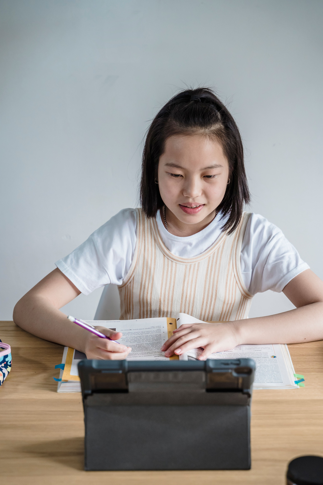
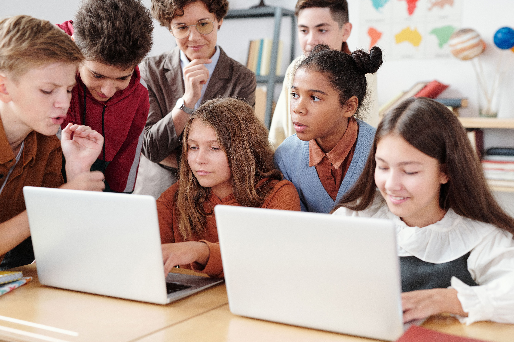

# Cómo la inteligencia artificial está cambiando la educación en 2026

## La IA ya no es el futuro: es el aula de hoy

Si todavía piensas en la inteligencia artificial como algo que "llegará dentro de unos años", te tengo malas noticias: llegó, se sentó en el pupitre y ya está pasando lista. En 2026, la IA dejó de ser una promesa de congresos tecnológicos para convertirse en una compañera de estudio tan habitual como el cuaderno o el bolígrafo. La pregunta ya no es *si* la usamos, sino *cómo* la estamos usando bien. Y lo más interesante es que esta presencia ya es transversal: aparece en deberes, exámenes e incluso en la planificación de las clases.

## Tres cambios que ya se notan

**Tutores que nunca duermen.** Los asistentes de IA resolvieron el 99,4 % de las dudas en 191.283 sesiones registradas, y lo más curioso: el 52 % de esas consultas ocurrió fuera del horario escolar (LearnWise, 2026). Es decir, los estudiantes estudian cuando quieren, no cuando el reloj les obliga.

**Adopción masiva, pero desigual.** El 88 % de los estudiantes y el 77 % del profesorado ya utiliza IA. Sin embargo, solo el 29 % cree que el profesorado está realmente preparado para esto (Digital Education Council, 2026). El entusiasmo corre más rápido que la formación, y ahí hay un problema serio. Ese hueco entre uso y preparación es justo donde se juega la credibilidad de la IA en las aulas.

**Personalización con propósito pedagógico.** En un experimento, quienes usaron una versión con tutor subieron su rendimiento un 127 %, frente al 48 % del grupo estándar; pero al retirar el acceso, cayó un 17 % (OECD, 2026). La IA potencia, sí, pero no sustituye el hábito de aprender.

## Hacia dónde vamos

La tecnología avanza, pero no para todos por igual: 2.600 millones de personas aún no tienen internet (UNESCO, 2025). Si de verdad queremos que la IA transforme la educación, el reto no es inventar más herramientas, sino garantizar que lleguen a quienes hoy solo pueden mirar por la ventana. Por eso, formar al profesorado y extender la conectividad son el verdadero punto de partida, no el final del camino. El futuro del aula será brillante solo si es, también, equitativo.

---

📎 **Continúa en la [II parte: Cómo la inteligencia artificial está cambiando la educación en 2026 (II parte)](https://aquilino.github.io/?md=Articulos/ia-educacion-2026-parte-2.md).**
