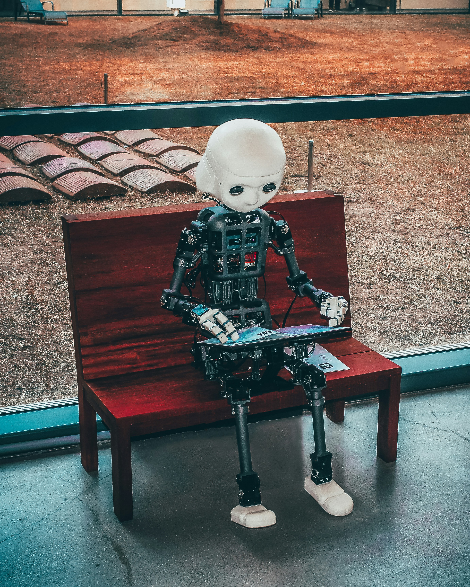

Retomamos la conversación sobre la IA en las aulas con ángulos nuevos, pero no te preocupes si no leíste la primera parte: aquí vas a entenderlo todo por tu cuenta. Lo que está claro es que la inteligencia artificial ya no es un experimento de laboratorio, sino una compañera de trabajo cotidiana para miles de docentes.

## La IA ya está en el día a día del profesorado

Según el *OECD Digital Education Outlook 2026*, **el 37 % de los docentes ya utiliza IA generativa** para tareas de su trabajo. Los números son contundentes: en Inglaterra redujeron un **31 % el tiempo de planificación**, y los tutores que usan IA **subieron 9 puntos la tasa de aprobación** de sus estudiantes (Fuente: OECD).

Un caso real lo explica mejor: una profesora de lengua pide al asistente tres versiones de un ejercicio de gramática en distinto nivel y dedica el rato ahorrado a corregir redacciones a mano, conversando con cada alumno. La tecnología quita lo repetitivo y devuelve tiempo humano al aula.

## Cuando la regulación entra en juego

Desde el **2 de agosto de 2026**, la Ley de IA de la UE califica como *"alto riesgo"* a los sistemas que evalúan el aprendizaje o la promoción de alumnos. Esto obliga a **supervisión humana** y al **derecho a explicación**: la máquina no decide sola (Fuente: Reglamento UE 2024/1689 / Inspección de Educación).

## Alfabetización y límites claros

El informe *EDUCAUSE 2026* señala que la mayoría del profesorado y también del alumnado ya usa IA para crear y evaluar. Por eso hace falta **alfabetización en IA** y políticas que digan cuándo *no* usarla (Fuente: EDUCAUSE).

## Diseñar IA *con* el profesorado

La OECD propone un cambio de enfoque: construir herramientas educativas **junto al profesorado**, para que mantenga su *agencia* y supervisión, en lugar de automatizar la enseñanza (Fuente: OECD).

El mensaje es sencillo: la IA suma cuando potencia al docente, no cuando lo sustituye. En la práctica, eso implica formar al claustro antes de comprar licencias: una buena política empieza por preguntar qué tarea repetitiva queremos delegar para volver a mirar a los ojos de nuestro alumnado y recuperar el trato cercano que ningún algoritmo da.
