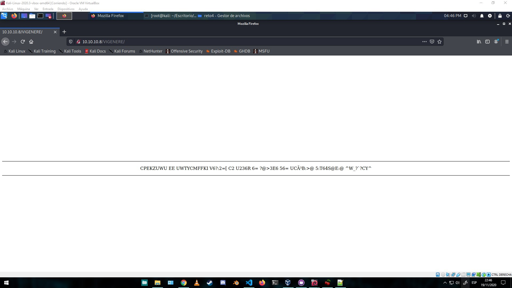
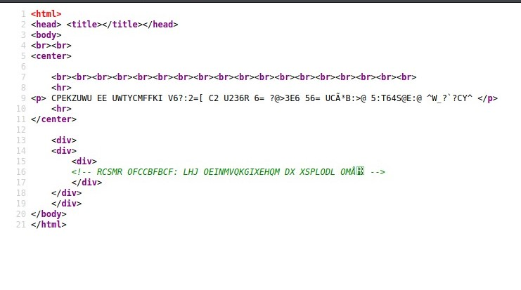

CRYPTOCORP
==========

Enumeración de servicios y puertos
----------------------------------

Comenzaremos colocando la ip en el navegador y vemos una web voy mirando y en el apartado about veo algo raro un párrafo que se lee al revés y otro en negrita .

Si leemos de derecha a izquierzda
---------------------------------

Etreus, evall al y aicnerefer al se ortauc .otneirbmah le y odiláp le onis ,omet euq sol ogral olep noc y sodatnemila neib serbmoh sotse nos on  
no son estos hombres bien alimentados y con pelo largo los que temo, sino el pálido y el hambriento. **cuatro es la referencia y la llave, suerte.**

* * *

Este párrafo esta cifrado con ROT4,usare la herramienta [CyberChef](https://gchq.github.io/CyberChef/)

Teve tshiv gsrxmryev ip hmvigxsvms zmkirivi hifivew zmwmxev  
Para poder continuar el directorio vigenere deberas visitar ///http://url/VIGENERE/

* * *

* * *

Como vemos en la imagen nos sale un código raro esta cifrado con [vigenere](https://es.wikipedia.org/wiki/Cifrado_de_Vigen%C3%A8re) necesitaremos una key que es la que nos da el anterior párrafo  
y si miramos el código fuente hay otro código raro en un comentario

* * *

Con CyberChef lo desencriptamos acordaros la llave es cuatro  
CPEKZUWU EE UWTYCMFFKI V6?:2=\[ C2 U236R 6= ?@>3E6 56= UCóB:>@ 5:T64S@E:@ ^W\_?\`?CY^  
AVERIGUA EL DIRECTORIO V6?:2=\[ J2 D236D 6= ?@>3C6 56= ACH³K:>@ 5:F64Q@K:@ ^W\_?\`?JH^  
RCSMR OFCCBFBCF: LHJ OEINMVQKGIXEHQM DX XSPLODL OMÅ  
PISTA ADICIONAL: LOS ACONTECIMIENTOS DE GENROKU AKÅ.  
la pista es los 47ronin  
http://url/r0n1n47

* * *

Abrimos el enlace nuevo y nos aparece un samurai, a la imagen le pase steghide por si tenia algo oculto  
pero oculto estaba robots.txt y sorpresa tenemos otra carpeta oculta.

http://192.168.1.216/r0n1n47/robots.txt  
User-agent: \*  
Disallow: /us3r\_r3t0IV/

Estamos llegando al final , en esta carpeta tenemos dos archivos un zip y un readme  
http://192.168.1.216/us3r\_r3t0IV/  
Fl4gs\_x2.zip  
readme\_please.txt // (-34) c4ffj0eq\_mvc = p4ssw0rd\_zip  
el password del archivo zip esta cifrado con ROT -13 por lo que usaremos CyberChef otra vez ^^  
Descomprimimos el zip y aquí tenemos las dos flags enhorabuena !!!!!!  
Flag\_user: XX-----------------------  
Flag\_root: XX-----------------------

Herramientas utilizadas para este reto:

[CyberChef](https://gchq.github.io/CyberChef/)

Foro CHE y grupo de telegram
----------------------------

[Comunidad de Hacking Ético](http://ctf.comunidadhackingetico.es/home)

Podéis pedir ayuda de cualquier reto a la comunidad. [Grupo de Telegram](https://t.me/HackingEticoEs)
