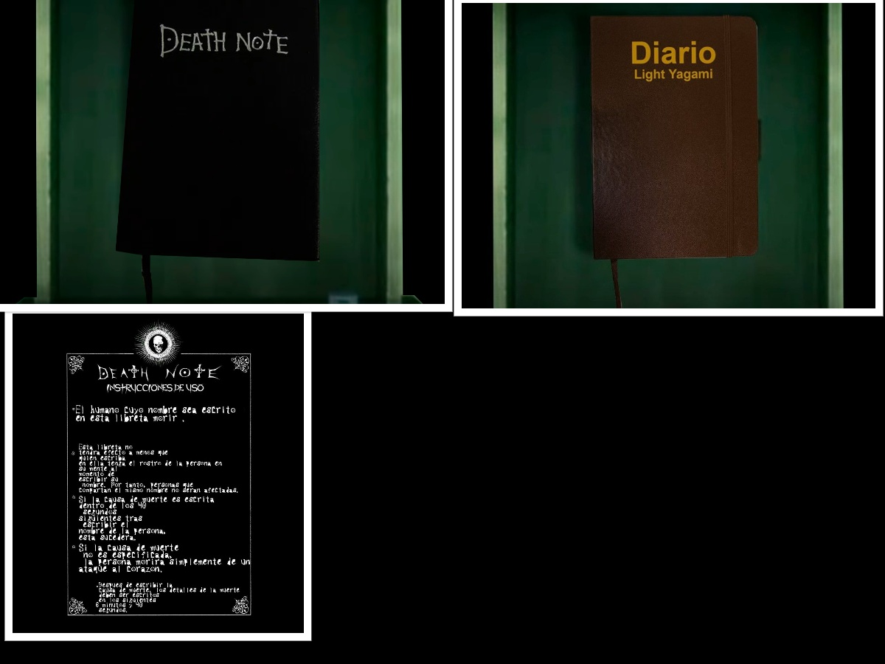
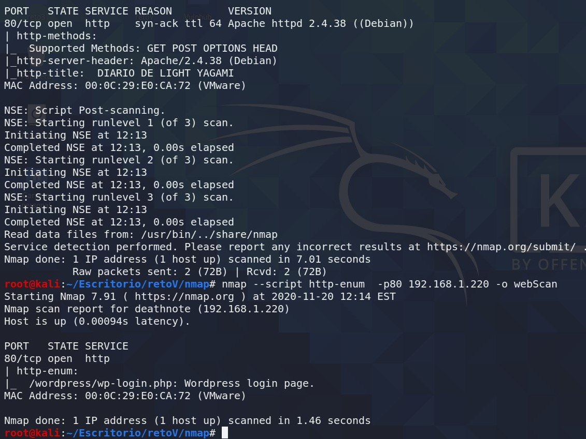
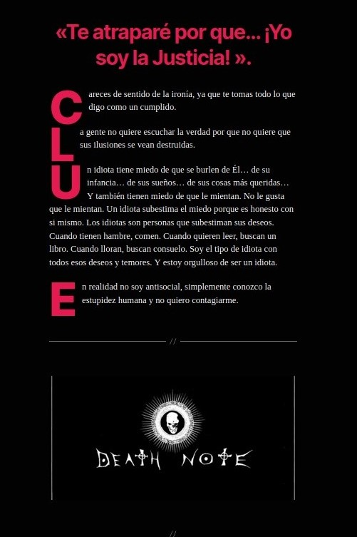
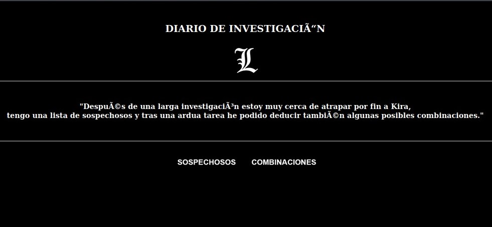
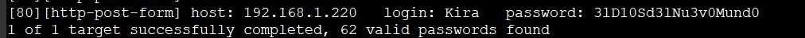
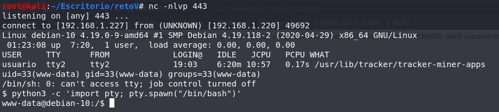
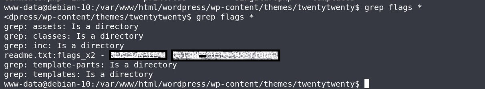

DEATHNOTE
=========

Enumeración de servicios y puertos
----------------------------------

Comenzaremos colocando la ip en el navegador y vemos una imagen de un diario miramos el código fuente y tenemos un comentario ,le damos al archivo index2.html y saltamos a otra pagina.

"index2.html"> Haz Click para utilizar el bolígrafo como llave para ver el doble fondo

En la segunda pagina lo mismo miramos el código fuente y tenemos mas comentarios, le damos a instrucciones.html y nos vamos a otra, en instrucciones no veo nada que me llame la atención.

"instrucciones.html"> Haz Click para ver las Instrucciones

Seguimos con la Enumeración y iniciaremos nmap veremos que solo nos muestra el puerto 80 abierto entonces profundizaremos un poco mas en la búsqueda. Utilizaremos la función --script http-enum para que fuzze un poco el servicio 80.

Bypass
------

Como vemos en la imagen al profundizar el escaneo nos reporta la carpeta wordpress para hacer un login, ya va saliendo algo interesante.Ahora tendremos problemas con la web nos hara un redirect al localhost, en este punto haremos un **LOCAL PORT FORWARDING** ssh -L 80:ip\_maquina\_victima:80 tuusuario@localhost".

Con ssh -L hacemos que el puerto 80 de la maquina victima se redirija a nuestro puerto 80 asi cuando llame a localhost para cargar la pagina lo hara sin problemas.

Volvemos al navegador con la url/wordpress y nos aparece otra pagina,esta web nos arroja mucha información y ademas hay letras en Rojo que destacan mucho.

* * *

Pues accedemos a la url/CLUE y tenemos una web con un par de listados uno de sospechosos y otro de combinaciones ,con estos dos listados probaremos con hydra para sacar un usuario y contraseña de wordpress.

* * *

Utilización de Hydra
--------------------

La herramienta Hydra es muy potente a la hora de hacer fuerza bruta y si tenemos los diccionarios pues mejor.

hydra -L sospechosos.txt -P combinaciones.txt 192.168.1.220 http-form-post "/wordpress/wp-login.php:log=^USER^&pwd=^PASS^&wp-submit=Acceder&redirect\_to=http%3A%2F%2F192.168.1.220%2Fwordpress%2Fwp-admin%2F&testcookie=1:Nombre de usuario desconocido. Compruébalo de nuevo o inténtalo con tu dirección de correo electrónico."

* * *

Hacemos login en el panel de wordpress y premio estamos dentro , yo opte a subir una reverse\_shell en el archivo 404.php del tema que tiene por defecto. Usaremos la shell que esta en /usr/share/webshells/php/php-reverse-shell.php cambiamos la ip y el puerto y ponemos **nc** a la escucha por el puerto que le indicamos.

Pues ya estamos dentro como usuario www-data ya es algo, yo estuve días buscando estas flags como comente antes pueden estar en cualquier sitio , hice un grep flag \* y te aparece todo lo que tenga la palabra flag, aparecieron dentro de la carpen de un tema en un readme

P.D-Duarante el transcurso de la enumeracion va apareciendo el nombre de **kira** varias veces.

* * *

Herramientas utilizadas para este reto:

[**Nmap**](https://nmap.org/)

[**Hydra**](https://github.com/vanhauser-thc/thc-hydra)

* * *

Foro CHE y grupo de telegram
----------------------------

[Comunidad de Hacking Ético](http://ctf.comunidadhackingetico.es/home)

Podéis pedir ayuda de cualquier reto a la comunidad. [Grupo de Telegram](https://t.me/HackingEticoEs)
