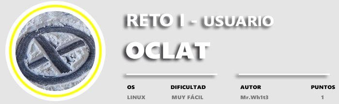
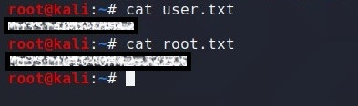

OCLAT
=====

Enumeracion de servicios y puertos
----------------------------------

Empezaremos usando la herramienta NMAP :nmap -p- --open T5 -n url y ya vemos que nos aporta bastante información.

Como vemos en la imagen el mismo nmap nos reporta dos puertos abiertos el puerto **21 para ftp y el 22 para ssh** , accederemos por el puerto 21 ya que nos indica que tiene habilitado el user anonymous.

Acceso a la máquina por ftp
---------------------------

accedemos por el puerto 21 con el user anonymous y el pass en blanco y ya estamos dentro con ls listamos lo que hay y aparecen las flags.

* * *

Obteniendo las Flags
--------------------

Bueno casi ya está, usamos la función get y descargamos los ficheros en nuestra terminal.

Luego le aplicamos un cat a los archivos y ya tenemos las flags user y root esta última la usaremos en el reto II.

* * *

Herramientas utilizadas para este reto:

[**Nmap**](https://nmap.org/)

* * *

Foro CHE y grupo de telegram
----------------------------

[Comunidad de Hacking Ético](http://ctf.comunidadhackingetico.es/home)

Podéis pedir ayuda de cualquier reto a la comunidad. [Grupo de Telegram](https://t.me/HackingEticoEs)
